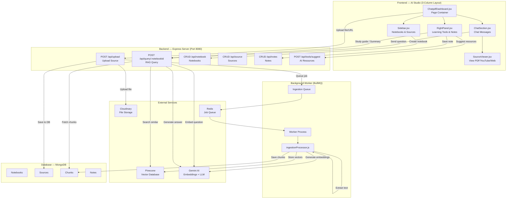
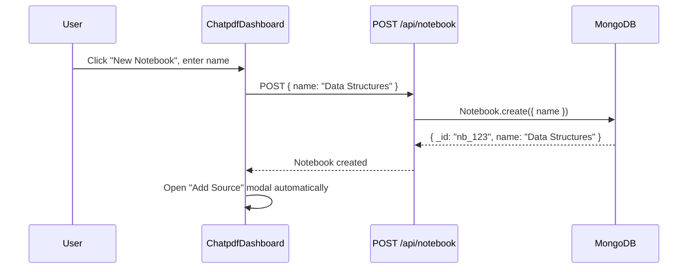
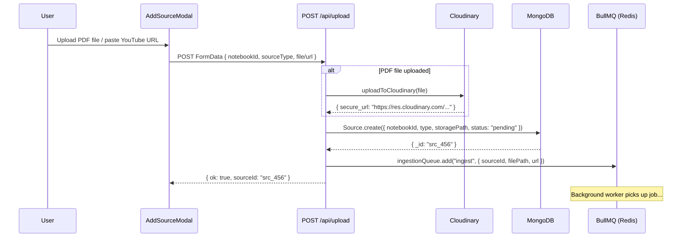
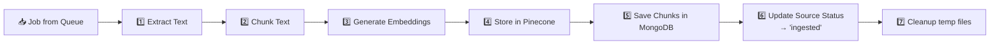
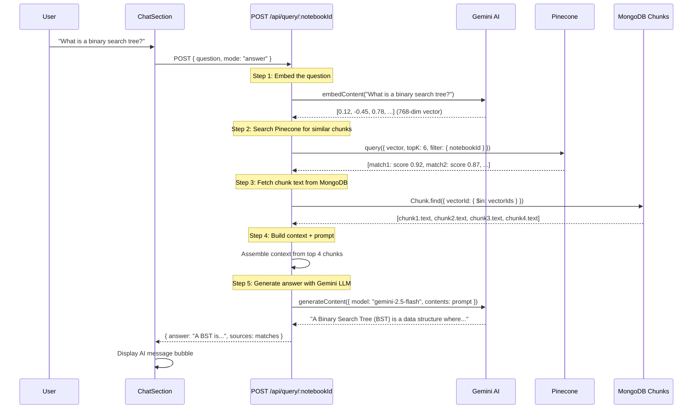
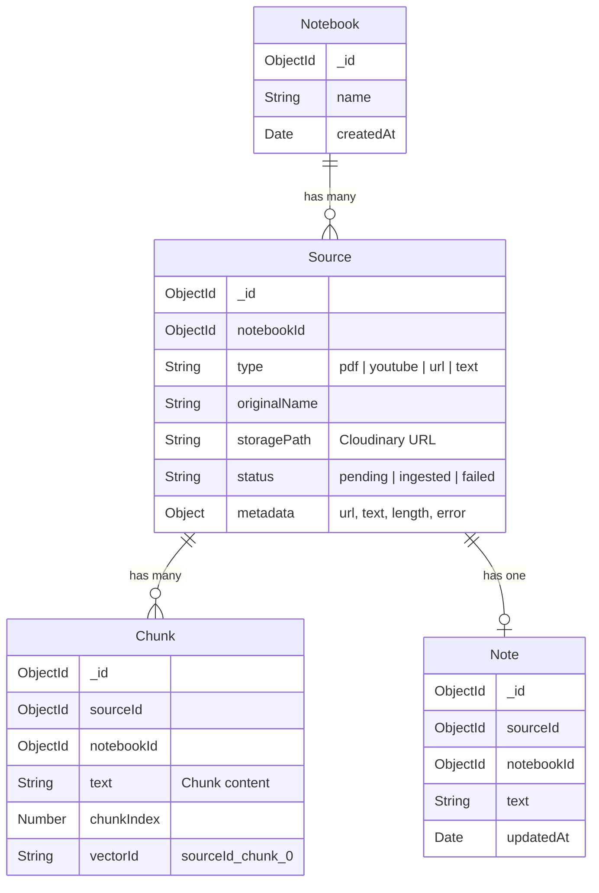
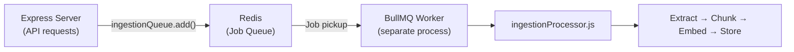

# Chat with PDF (AI Studio) Module — Complete Detailed Explanation

## Overview

The **Chat with PDF** module (internally called **AI Studio**) is a NotebookLM-style RAG (Retrieval-Augmented Generation) system. Users upload PDFs, YouTube links, or websites into **notebooks**, and the system extracts, chunks, embeds, and stores the content. Users can then **ask questions** and get AI-generated answers grounded in their actual documents.

---

## High-Level Architecture



---

## All Files Involved

### Frontend (17 files)

| File | Role |
|------|------|
| [ChatpdfDashboard.jsx](file:///c:/Users/ASUS/OneDrive/Desktop/repo/learnspher/frontend/src/Chatpdf/ChatpdfDashboard.jsx) | **Main page container** — 3-column grid, state management, API calls |
| [chat.css](file:///c:/Users/ASUS/OneDrive/Desktop/repo/learnspher/frontend/src/Chatpdf/chat.css) | Grid layout (270px sidebar \| 1fr chat \| 300px right panel) |
| [Sidebar.jsx](file:///c:/Users/ASUS/OneDrive/Desktop/repo/learnspher/frontend/src/Chatpdf/Sidebar.jsx) | Notebook list, expandable source tree, notes indicator |
| [Sidebar.css](file:///c:/Users/ASUS/OneDrive/Desktop/repo/learnspher/frontend/src/Chatpdf/Sidebar.css) | Sidebar styling |
| [ChatSection.jsx](file:///c:/Users/ASUS/OneDrive/Desktop/repo/learnspher/frontend/src/Chatpdf/ChatSection.jsx) | Chat messages + input box + source viewer split view |
| [ChatSection.css](file:///c:/Users/ASUS/OneDrive/Desktop/repo/learnspher/frontend/src/Chatpdf/ChatSection.css) | Chat bubble/message styling |
| [SourceViewer.jsx](file:///c:/Users/ASUS/OneDrive/Desktop/repo/learnspher/frontend/src/Chatpdf/SourceViewer.jsx) | Renders PDF/YouTube/Website/text sources inline |
| [SourceViewer.css](file:///c:/Users/ASUS/OneDrive/Desktop/repo/learnspher/frontend/src/Chatpdf/SourceViewer.css) | Source viewer styling |
| [RightPanel.jsx](file:///c:/Users/ASUS/OneDrive/Desktop/repo/learnspher/frontend/src/Chatpdf/RightPanel.jsx) | **Learning tools** — Study Guide, Summary, Reports, Suggest Resources, Notes |
| [RightPanel.css](file:///c:/Users/ASUS/OneDrive/Desktop/repo/learnspher/frontend/src/Chatpdf/RightPanel.css) | Right panel styling |
| [CreateNotebookModal.jsx](file:///c:/Users/ASUS/OneDrive/Desktop/repo/learnspher/frontend/src/Chatpdf/CreateNotebookModal.jsx) | Modal to create new notebooks |
| [AddSourceModal.jsx](file:///c:/Users/ASUS/OneDrive/Desktop/repo/learnspher/frontend/src/Chatpdf/AddSourceModal.jsx) | Modal to upload PDF/YouTube/Website/text sources |
| [api.js](file:///c:/Users/ASUS/OneDrive/Desktop/repo/learnspher/frontend/src/Chatpdf/api.js) | `API_BASE_URL = "http://localhost:8080/api"` |

### Backend (16 files)

| File | Role |
|------|------|
| [app.js](file:///c:/Users/ASUS/OneDrive/Desktop/repo/learnspher/backend/src/app.js) | Express app — registers all routes |
| [server.js](file:///c:/Users/ASUS/OneDrive/Desktop/repo/learnspher/backend/src/server.js) | Starts server on port 8080, connects MongoDB |
| [upload.js](file:///c:/Users/ASUS/OneDrive/Desktop/repo/learnspher/backend/src/routes/upload.js) | File upload → Cloudinary → create Source → queue ingestion |
| [query.js](file:///c:/Users/ASUS/OneDrive/Desktop/repo/learnspher/backend/src/routes/query.js) | **RAG query engine** — embed question → Pinecone search → Gemini answer |
| [notebook.js](file:///c:/Users/ASUS/OneDrive/Desktop/repo/learnspher/backend/src/routes/notebook.js) | CRUD for notebooks (with cascade delete) |
| [source.js](file:///c:/Users/ASUS/OneDrive/Desktop/repo/learnspher/backend/src/routes/source.js) | CRUD for sources |
| [notes.js](file:///c:/Users/ASUS/OneDrive/Desktop/repo/learnspher/backend/src/routes/notes.js) | CRUD for notes (upsert per source) |
| [tools.js](file:///c:/Users/ASUS/OneDrive/Desktop/repo/learnspher/backend/src/routes/tools.js) | AI resource suggestions via Gemini |
| [ingestionProcessor.js](file:///c:/Users/ASUS/OneDrive/Desktop/repo/learnspher/backend/src/utils/ingestionProcessor.js) | **Core pipeline** — extract → chunk → embed → store |
| [extractors.js](file:///c:/Users/ASUS/OneDrive/Desktop/repo/learnspher/backend/src/utils/extractors.js) | PDF (pdfjs-dist), Website (cheerio), YouTube transcript extractors |
| [chunker.js](file:///c:/Users/ASUS/OneDrive/Desktop/repo/learnspher/backend/src/utils/chunker.js) | Splits text into overlapping chunks |
| [vectordbClient.js](file:///c:/Users/ASUS/OneDrive/Desktop/repo/learnspher/backend/src/utils/vectordbClient.js) | Pinecone + Gemini embedding functions |
| [cloudinary.js](file:///c:/Users/ASUS/OneDrive/Desktop/repo/learnspher/backend/src/utils/cloudinary.js) | Cloudinary file upload helper |
| [Ingestionqueue.js](file:///c:/Users/ASUS/OneDrive/Desktop/repo/learnspher/backend/src/workers/Ingestionqueue.js) | BullMQ queue definition |
| [Workerqueue.js](file:///c:/Users/ASUS/OneDrive/Desktop/repo/learnspher/backend/src/workers/Workerqueue.js) | BullMQ worker process (separate Node process) |
| Models: [Notebook.js](file:///c:/Users/ASUS/OneDrive/Desktop/repo/learnspher/backend/src/models/Notebook.js), [Source.js](file:///c:/Users/ASUS/OneDrive/Desktop/repo/learnspher/backend/src/models/Source.js), [Chunks.js](file:///c:/Users/ASUS/OneDrive/Desktop/repo/learnspher/backend/src/models/Chunks.js), [Note.js](file:///c:/Users/ASUS/OneDrive/Desktop/repo/learnspher/backend/src/models/Note.js) | MongoDB schemas |

---

## Step-by-Step: Complete Flow

### STEP 1 — User Creates a Notebook



**Code:** [ChatpdfDashboard.jsx, handleCreateNotebook](file:///c:/Users/ASUS/OneDrive/Desktop/repo/learnspher/frontend/src/Chatpdf/ChatpdfDashboard.jsx#L64-L87)

---

### STEP 2 — User Uploads a Source (PDF/YouTube/Website/Text)



**Supported source types:**

| Type | Input | How it's stored |
|------|-------|-----------------|
| **PDF** | File upload | File → Cloudinary URL → stored in `storagePath` |
| **YouTube** | YouTube URL | URL stored in `metadata.url` |
| **Website** | Any URL | URL stored in `metadata.url` |
| **Text** | Pasted text | Text stored in `metadata.text` |

**Code:** [upload.js](file:///c:/Users/ASUS/OneDrive/Desktop/repo/learnspher/backend/src/routes/upload.js#L23-L87)

---

### STEP 3 — Background Ingestion Pipeline (The RAG Core)

This is the most critical part. A **separate worker process** picks up the queued job and processes it through a 7-step pipeline:



#### 1️⃣ Extract Text

| Source Type | Extractor | Library | Details |
|-------------|-----------|---------|---------|
| **PDF** | `extractFromPDF()` | `pdfjs-dist` | Reads PDF binary, extracts text page-by-page |
| **YouTube** | `extractFromYoutube()` | Custom `youtube.js` | Fetches video transcript/captions |
| **Website** | `extractFromUrl()` | `cheerio` + `node-fetch` | Fetches HTML, strips nav/footer/ads, extracts `<article>` or `<main>` text. Capped at 50K chars |

**Code:** [extractors.js](file:///c:/Users/ASUS/OneDrive/Desktop/repo/learnspher/backend/src/utils/extractors.js)

#### 2️⃣ Chunk Text

Splits the extracted text into overlapping chunks for better retrieval:

| Source Type | Chunk Size | Overlap |
|------------|-----------|---------|
| YouTube | 1,500 chars | 200 chars |
| Website | 2,000 chars | 300 chars |
| PDF | 1,500 chars | 300 chars |

- **Max 30 chunks** per source (to avoid excessive API calls)
- Overlap ensures no context is lost at chunk boundaries

**Code:** [ingestionProcessor.js, lines 32-45](file:///c:/Users/ASUS/OneDrive/Desktop/repo/learnspher/backend/src/utils/ingestionProcessor.js#L32-L45)

#### 3️⃣ Generate Embeddings (Gemini)

Each chunk is converted to a **768-dimensional vector** using Gemini's embedding model:

```js
const result = await ai.models.embedContent({
  model: "gemini-embedding-001",
  contents: chunkText,
  config: { outputDimensionality: 768 }
});
```

- **Rate limiting protection**: 500ms delay between calls, 3 retries with exponential backoff (2s, 4s, 6s)
- Failed embeddings are skipped (not stored)

**Code:** [vectordbClient.js, embedWithGemini](file:///c:/Users/ASUS/OneDrive/Desktop/repo/learnspher/backend/src/utils/vectordbClient.js#L35-L73)

#### 4️⃣ Store Vectors in Pinecone

```js
const vectors = chunks.map((chunk, i) => ({
  id: `${sourceId}_chunk_${i}`,
  values: embeddings[i],         // 768-dim float array
  metadata: {
    text: chunk,
    sourceId: sourceId,
    notebookId: notebookId,
    chunkIndex: i
  }
}));
await index.upsert(vectors);
```

**Code:** [ingestionProcessor.js, lines 72-100](file:///c:/Users/ASUS/OneDrive/Desktop/repo/learnspher/backend/src/utils/ingestionProcessor.js#L72-L100)

#### 5️⃣ Save Chunks in MongoDB

A mirror of Pinecone data is saved in MongoDB's `Chunk` collection for easy access:

```js
await Chunk.insertMany(chunkDocs);
// Each doc: { sourceId, notebookId, text, chunkIndex, vectorId }
```

#### 6️⃣ Update Source Status

```js
await Source.findByIdAndUpdate(sourceId, {
  status: "ingested",         // "pending" → "ingested"
  "metadata.text": rawText,   // Store full extracted text
  "metadata.length": rawText.length
});
```

> [!IMPORTANT]
> The source status goes through: `pending` → `ingested` (or `failed`). The SourceViewer shows this as status badges (⏳ Processing / ✅ Ready / ❌ Failed).

---

### STEP 4 — User Asks a Question (RAG Query)

This is where the magic happens — the **Retrieval-Augmented Generation** pipeline:



#### The RAG Prompt

```
You are a helpful RAG AI assistant.

STRICT RULES:
- Use ONLY the given context
- If answer is not present, reply EXACTLY: "NOT FOUND"
- Do NOT guess or hallucinate
- Always cite sources like: (Source <sourceId>, Chunk <chunkIndex>)

Context:
Source: src_456 | Chunk: 0
A binary search tree is a node-based data structure...

---

Source: src_456 | Chunk: 1
BST operations include insertion, deletion, and search...

Question:
What is a binary search tree?

Answer:
```

**Code:** [query.js](file:///c:/Users/ASUS/OneDrive/Desktop/repo/learnspher/backend/src/routes/query.js#L14-L78)

---

### STEP 5 — Multiple Query Modes

The same `/api/query/:notebookId` endpoint supports **5 different modes**:

| Mode | Triggered By | What It Does |
|------|-------------|--------------|
| `answer` | User sends a chat message | Standard RAG Q&A with context citations |
| `summary` | RightPanel → "Summary" button | Generates a detailed summary of all content |
| `study_guide` | RightPanel → "Study Guide" button | Creates structured guide with headings, key concepts |
| `audio` | Audio tool | Generates a 90-second spoken explanation → Text-to-Speech → audio file |
| `pdf_report` | Report tool | Generates a detailed report → creates PDF file |

**Code:** [query.js, modes](file:///c:/Users/ASUS/OneDrive/Desktop/repo/learnspher/backend/src/routes/query.js#L83-L175)

---

### STEP 6 — Source Viewer (View Your Documents)

When a user clicks a source in the sidebar, the **SourceViewer** renders the content inline beside the chat:

| Source Type | How It's Displayed |
|-------------|-------------------|
| **PDF** | Google Docs viewer iframe (`docs.google.com/gview?url=...&embedded=true`) |
| **YouTube** | Clickable thumbnail with play overlay + extracted transcript below |
| **Website** | Iframe embed (with fallback to extracted text if blocked by CORS) |
| **Text** | Plain text in a `<pre>` block |

The chat area becomes a **split view** when a source is opened:
```
| Sidebar | Chat Messages | Source Viewer | Right Panel |
| 270px   | ← split →    | ← split →    | 300px       |
```

**Code:** [SourceViewer.jsx](file:///c:/Users/ASUS/OneDrive/Desktop/repo/learnspher/frontend/src/Chatpdf/SourceViewer.jsx)

---

### STEP 7 — Learning Tools (Right Panel)

The [RightPanel](file:///c:/Users/ASUS/OneDrive/Desktop/repo/learnspher/frontend/src/Chatpdf/RightPanel.jsx) provides 5 AI-powered learning tools:

#### 💡 Suggest Resources
- Calls `POST /api/tools/suggest/:sourceId`
- Sends source content chunks to Gemini with a prompt to suggest:
  - 3 YouTube videos (real channels like Khan Academy, Gate Smashers)
  - 3 Websites (GeeksForGeeks, MDN, etc.)
  - 3 Books (real textbooks)
- Returns structured JSON displayed in a modal with clickable links

**Code:** [tools.js](file:///c:/Users/ASUS/OneDrive/Desktop/repo/learnspher/backend/src/routes/tools.js)

#### 📘 Study Guide
- Calls `POST /api/query/:notebookId` with `mode: "study_guide"`
- Gemini creates a structured study guide with headings and key concepts
- Displayed in a modal overlay

#### 📊 Reports
- Calls RAG query with analytics-focused question
- Shows word count, key topics, difficulty level, reading time

#### 📄 Summary
- Calls `POST /api/query/:notebookId` with `mode: "summary"`
- Gemini generates a detailed summary from all chunks
- Displayed in a modal overlay

#### 📝 Notes
- Per-source notes with a textarea
- Auto-loads existing notes when source changes (`GET /api/notes/source/:id`)
- Saves via `POST /api/notes` (upsert — updates if exists, creates if not)
- Notes are shown with a 📝 indicator in the sidebar

---

## Database Models



---

## Frontend UI Layout

```
┌──────────────┬──────────────────────────────────┬────────────────────┐
│              │                                  │                    │
│   SIDEBAR    │         CHAT SECTION             │   RIGHT PANEL      │
│   (270px)    │         (flexible)               │   (300px)          │
│              │                                  │                    │
│ ┌──────────┐ │  ┌─────────────────────────────┐ │ ┌────────────────┐ │
│ │ Notebooks│ │  │ Header: Notebook Name       │ │ │ 💡 Suggest     │ │
│ │          │ │  │ + Source Count               │ │ │    Resources   │ │
│ │ ▶ DS     │ │  ├─────────────────────────────┤ │ ├────────────────┤ │
│ │   📄 BST │ │  │                             │ │ │ 📘 Study Guide │ │
│ │   📄 Sort│ │  │  Chat Messages              │ │ ├────────────────┤ │
│ │          │ │  │                             │ │ │ 📊 Reports     │ │
│ │ ▶ ML     │ │  │  User: What is BST?        │ │ ├────────────────┤ │
│ │   🎥 YT  │ │  │  AI: A BST is a data...   │ │ │ 📄 Summary     │ │
│ │   🌐 Web │ │  │                             │ │ ├────────────────┤ │
│ │          │ │  │                             │ │ │ 📝 Notes       │ │
│ └──────────┘ │  ├─────────────────────────────┤ │ │ [textarea]     │ │
│              │  │ [Message input] [Send]      │ │ │ [Save Notes]   │ │
│ [+Notebook]  │  └─────────────────────────────┘ │ └────────────────┘ │
└──────────────┴──────────────────────────────────┴────────────────────┘
```

When a source is clicked, the chat area splits:
```
┌──────────┬──────────────┬──────────────┬────────────────┐
│ SIDEBAR  │ CHAT AREA    │SOURCE VIEWER │ RIGHT PANEL    │
│          │ (50%)        │ (50%)        │                │
│          │              │ PDF/YT/Web   │                │
│          │              │ displayed    │                │
│          │              │ here         │                │
└──────────┴──────────────┴──────────────┴────────────────┘
```

---

## Background Worker Architecture

The system uses **two separate Node.js processes** run concurrently:

```
npm run dev
  ├── npm run server  →  node src/server.js  (Express API on port 8080)
  └── npm run worker  →  node src/workers/Workerqueue.js  (BullMQ worker)
```



- **Redis** acts as the message broker between the API server and the worker
- The worker connects to MongoDB independently and processes jobs asynchronously
- If Redis is unavailable, the worker retries 3 times then skips gracefully

**Code:** [Workerqueue.js](file:///c:/Users/ASUS/OneDrive/Desktop/repo/learnspher/backend/src/workers/Workerqueue.js)

---

## Complete Data Flow Summary

```
1. User creates Notebook → MongoDB
       ↓
2. User uploads Source (PDF/YouTube/URL/Text)
   → File goes to Cloudinary (for PDFs)
   → Source record created in MongoDB (status: "pending")
   → Job queued in Redis via BullMQ
       ↓
3. Background Worker picks up job → ingestionProcessor.js
   → Extract text (pdfjs-dist / cheerio / youtube transcript)
   → Chunk text (1500-2000 chars with overlap)
   → Generate embeddings (Gemini gemini-embedding-001, 768-dim)
   → Store vectors in Pinecone (with notebookId filter metadata)
   → Save chunks in MongoDB
   → Update source status → "ingested" ✅
       ↓
4. User asks question in chat
   → Embed question with Gemini
   → Search Pinecone for top 6 similar vectors (filtered by notebookId)
   → Fetch matching chunk texts from MongoDB
   → Build RAG prompt with context (top 4 chunks)
   → Generate answer with Gemini 2.5 Flash
   → Return answer + source citations to frontend
       ↓
5. User uses Learning Tools
   → Study Guide / Summary: RAG query with special mode
   → Suggest Resources: Gemini generates YouTube/website/book suggestions
   → Notes: Saved per-source in MongoDB (upsert)
   → Reports: Analytics query about the content
```

---

## Tech Stack Summary

| Layer | Technology |
|-------|-----------|
| **Frontend** | React, Vite, Lucide icons |
| **Backend API** | Express.js (port 8080) |
| **LLM** | Google Gemini 2.5 Flash |
| **Embeddings** | Gemini Embedding 001 (768-dim) |
| **Vector DB** | Pinecone |
| **Database** | MongoDB (Mongoose ODM) |
| **File Storage** | Cloudinary |
| **Job Queue** | BullMQ + Redis |
| **PDF Parsing** | pdfjs-dist |
| **Web Scraping** | Cheerio + node-fetch |
| **Process Manager** | concurrently (runs server + worker) |
