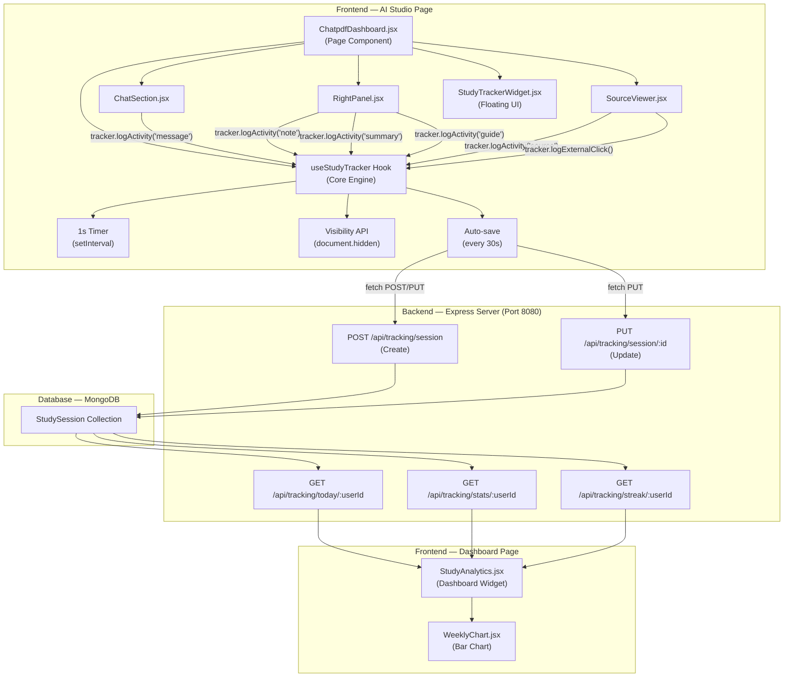
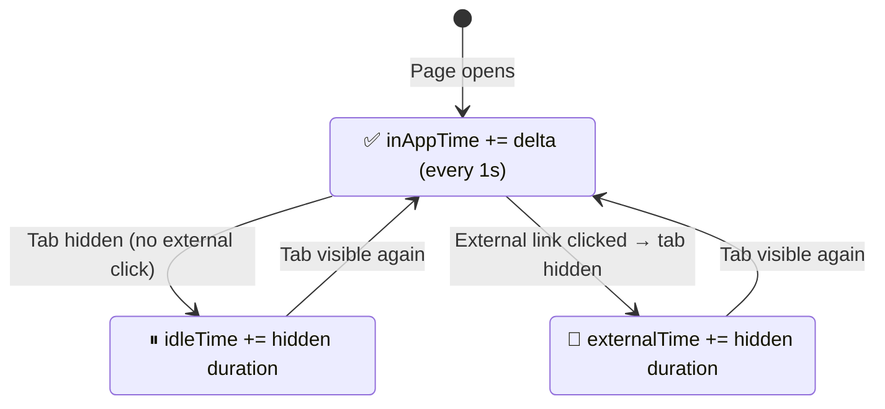
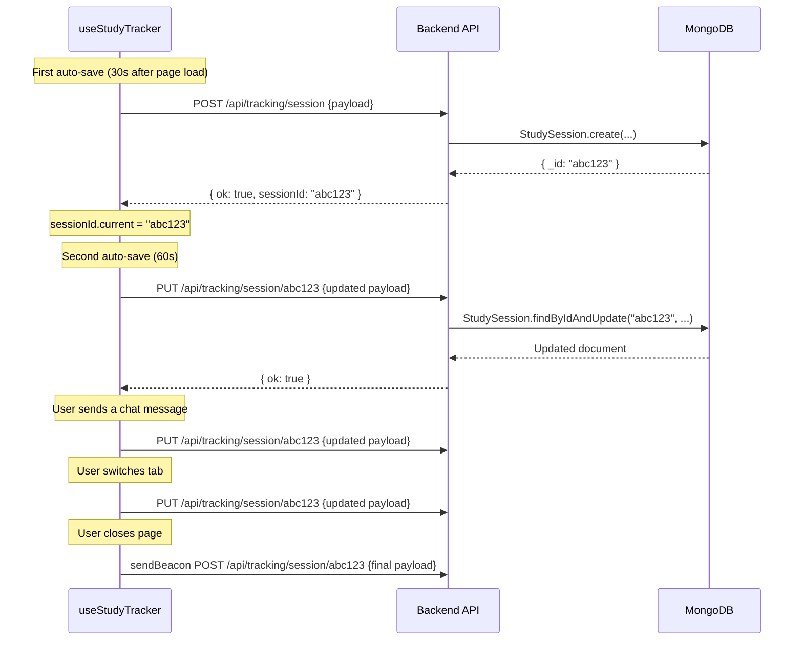

# Study Tracking Module — Complete Detailed Explanation

## Overview

The Study Tracking Module is a **fully automatic, passive** system that tracks how long a student studies on the LearnSphere platform and what activities they perform. It requires **zero manual input** — no start/stop buttons. It works silently in the background while the student uses the AI Studio (ChatPDF) page.

---

## Architecture Diagram



---

## All Files Involved

| File | Role | Location |
|------|------|----------|
| [useStudyTracker.js](file:///c:/Users/ASUS/OneDrive/Desktop/repo/learnspher/frontend/src/hooks/useStudyTracker.js) | **Core tracking engine** — timer, activity logging, auto-save | Frontend Hook |
| [StudyTrackerWidget.jsx](file:///c:/Users/ASUS/OneDrive/Desktop/repo/learnspher/frontend/src/Chatpdf/StudyTrackerWidget.jsx) | **Floating live UI** — shows timer + activities in real-time | Frontend Component |
| [StudyTrackerWidget.css](file:///c:/Users/ASUS/OneDrive/Desktop/repo/learnspher/frontend/src/Chatpdf/StudyTrackerWidget.css) | Styling for the floating widget | Frontend CSS |
| [ChatpdfDashboard.jsx](file:///c:/Users/ASUS/OneDrive/Desktop/repo/learnspher/frontend/src/Chatpdf/ChatpdfDashboard.jsx) | Initializes the tracker hook, passes to children | Frontend Page |
| [ChatSection.jsx](file:///c:/Users/ASUS/OneDrive/Desktop/repo/learnspher/frontend/src/Chatpdf/ChatSection.jsx) | Logs `message` activity on chat send | Frontend Component |
| [RightPanel.jsx](file:///c:/Users/ASUS/OneDrive/Desktop/repo/learnspher/frontend/src/Chatpdf/RightPanel.jsx) | Logs `note`, `summary`, `guide` activities | Frontend Component |
| [SourceViewer.jsx](file:///c:/Users/ASUS/OneDrive/Desktop/repo/learnspher/frontend/src/Chatpdf/SourceViewer.jsx) | Logs `source` activity + external clicks | Frontend Component |
| [tracking.js](file:///c:/Users/ASUS/OneDrive/Desktop/repo/learnspher/backend/src/routes/tracking.js) | **API routes** — create, update, query sessions | Backend Route |
| [StudySession.js](file:///c:/Users/ASUS/OneDrive/Desktop/repo/learnspher/backend/src/models/StudySession.js) | **MongoDB schema** for study sessions | Backend Model |
| [StudyAnalytics.jsx](file:///c:/Users/ASUS/OneDrive/Desktop/repo/learnspher/frontend/src/components/Dashboard/StudyAnalytics.jsx) | **Dashboard widget** — displays stats, time, score | Frontend Component |
| [WeeklyChart.jsx](file:///c:/Users/ASUS/OneDrive/Desktop/repo/learnspher/frontend/src/components/Dashboard/WeeklyChart.jsx) | **Bar chart** — 7-day activity visualization | Frontend Component |

---

## Step-by-Step: How It Works

### STEP 1 — Timer Starts Automatically

When the user navigates to the **AI Studio** page, `ChatpdfDashboard.jsx` mounts and calls the hook:

```js
// ChatpdfDashboard.jsx, line 19
const tracker = useStudyTracker({ 
  page: 'ai_studio', 
  notebookId: selectedNotebook?._id || selectedNotebook?.id || null 
});
```

Inside the hook, **three things happen immediately**:

1. **Session start time is recorded**:
   ```js
   const startedAt = useRef(new Date());  // line 27
   ```

2. **A 1-second interval timer begins**:
   ```js
   // line 180-194
   timerRef.current = setInterval(() => {
     const now = Date.now();
     const delta = (now - lastTick.current) / 1000;
     lastTick.current = now;
     
     if (isVisible.current) {
       inAppTime.current += delta;         // accumulate active time
       setElapsed(Math.floor(inAppTime.current)); // update UI state
     }
   }, 1000);
   ```

3. **Auto-save interval starts (every 30 seconds)**:
   ```js
   // line 197-203
   const autoSave = setInterval(() => {
     saveSession(false);
   }, AUTO_FLUSH_INTERVAL); // 30,000 ms
   ```

> [!IMPORTANT]
> **No button click needed!** The timer starts the instant the AI Studio page loads. It only counts time when the browser tab is visible/focused.

---

### STEP 2 — Three Types of Time Are Tracked



| Time Type | When It Accumulates | How It's Measured |
|-----------|-------------------|-------------------|
| **In-App Time** | User is actively on the AI Studio tab | Timer ticks +1s every second while `document.hidden === false` |
| **External Time** | User clicked a YouTube/website link, left the tab, then came back | Measured via `visibilitychange` event — duration between tab hidden → tab visible, only when an external click was registered first |
| **Idle Time** | User switched tabs without clicking an external link (checking email, etc.) | Duration the tab was hidden WITHOUT a prior external click |

#### How Visibility Tracking Works (line 206-262):

```js
document.addEventListener('visibilitychange', () => {
  if (document.hidden) {
    // User left the tab
    isVisible.current = false;
    
    if (externalClickPending.current) {
      externalLeftAt.current = Date.now(); // mark when they left
    }
    
    saveSession(false); // auto-save immediately when leaving
  } else {
    // User returned to the tab  
    if (externalClickPending.current && externalLeftAt.current) {
      // They were viewing an external resource
      externalTime.current += hiddenDuration;
      // Record the external click details
    } else {
      // They were just idle
      idleTime.current += hiddenDuration;
    }
    
    isVisible.current = true;
  }
});
```

---

### STEP 3 — Activities Are Logged

The `tracker` object is passed down to child components as a prop:

```jsx
// ChatpdfDashboard.jsx
<ChatSection tracker={tracker} />
<RightPanel tracker={tracker} />
```

Each component calls `tracker.logActivity(type)` when the user performs an action:

| Component | Action | Code |
|-----------|--------|------|
| **ChatSection.jsx** | User sends a chat message | `tracker.logActivity('message')` — [line 15](file:///c:/Users/ASUS/OneDrive/Desktop/repo/learnspher/frontend/src/Chatpdf/ChatSection.jsx#L15) |
| **RightPanel.jsx** | User saves a note | `tracker.logActivity('note')` — [line 83](file:///c:/Users/ASUS/OneDrive/Desktop/repo/learnspher/frontend/src/Chatpdf/RightPanel.jsx#L83) |
| **RightPanel.jsx** | User generates a summary | `tracker.logActivity('summary')` — [line 179](file:///c:/Users/ASUS/OneDrive/Desktop/repo/learnspher/frontend/src/Chatpdf/RightPanel.jsx#L179) |
| **RightPanel.jsx** | User views a study guide | `tracker.logActivity('guide')` — [line 131](file:///c:/Users/ASUS/OneDrive/Desktop/repo/learnspher/frontend/src/Chatpdf/RightPanel.jsx#L131) |
| **SourceViewer.jsx** | User opens a source viewer | `tracker.logActivity('source')` — [line 15](file:///c:/Users/ASUS/OneDrive/Desktop/repo/learnspher/frontend/src/Chatpdf/SourceViewer.jsx#L15) |
| **SourceViewer.jsx** | User clicks YouTube/website link | `tracker.logExternalClick(type, url)` — [line 21](file:///c:/Users/ASUS/OneDrive/Desktop/repo/learnspher/frontend/src/Chatpdf/SourceViewer.jsx#L21) |

#### What `logActivity()` does internally (line 276-323):

```js
const logActivity = (type) => {
  // 1. Increment the counter
  activities.current.messagesAsked += 1; // (for 'message' type)
  
  // 2. Update React state so the widget UI updates
  setActivityCounts({ ...activities.current });
  
  // 3. Add to the activity feed log
  setActivityLog(prev => [...prev.slice(-19), {
    type: 'message',
    label: 'Question asked',
    icon: '💬',
    time: new Date()
  }]);
  
  // 4. Immediately save to backend (so dashboard picks it up)
  saveSession(false);
};
```

> [!TIP]
> Every activity triggers an **immediate save** to the backend. This means the Dashboard analytics update within seconds, not just when you leave the page.

---

### STEP 4 — Data is Saved to Backend

The `saveSession()` function (line 118-146) uses a **create-once, update-thereafter** pattern:



**Key design decisions:**
- **First save** → `POST /api/tracking/session` (creates a new document, returns sessionId)
- **All subsequent saves** → `PUT /api/tracking/session/:id` (updates the same document)
- **Page close** → Uses `navigator.sendBeacon()` for reliability (works even as the page unloads), falls back to `fetch()` with `keepalive: true`
- Sessions under **10 seconds** are automatically discarded

#### The Payload Sent to Backend:

```json
{
  "userId": "firebase-uid-abc123",
  "notebookId": "notebook-xyz",
  "materialId": null,
  "startedAt": "2026-04-02T07:00:00.000Z",
  "endedAt": "2026-04-02T07:45:00.000Z",
  "inAppTime": 2400,
  "externalTime": 300,
  "idleTime": 120,
  "totalTime": 2700,
  "activities": {
    "messagesAsked": 12,
    "sourcesOpened": 3,
    "notesWritten": 2,
    "summariesGenerated": 1,
    "studyGuidesViewed": 0,
    "externalClicks": [
      {
        "type": "youtube",
        "url": "https://youtube.com/watch?v=...",
        "leftAt": "2026-04-02T07:15:00.000Z",
        "returnedAt": "2026-04-02T07:20:00.000Z",
        "duration": 300
      }
    ]
  },
  "productivityScore": 72,
  "page": "ai_studio"
}
```

---

### STEP 5 — Productivity Score Calculation

The score (0–100) is calculated client-side before each save (line 68-92):

```
Score = Base Time Points + Activity Bonuses - Idle Penalty
```

| Factor | Formula | Max Points |
|--------|---------|------------|
| **Time ≥ 1 hour** | 45 pts | 45 |
| **Time ≥ 30 min** | 35 pts | 35 |
| **Time ≥ 15 min** | 20 pts | 20 |
| **Time ≥ 5 min** | 10 pts | 10 |
| **Messages** | 3 pts × count | 15 |
| **Sources opened** | 2 pts × count | 10 |
| **Notes written** | 5 pts × count | 15 |
| **Summaries + Guides** | 5 pts × count | 10 |
| **External clicks** | 2 pts × count | 6 |
| **Idle penalty** | −10 if idle > 50% of session | −10 |

**Example:** A student who studies for 20 minutes, asks 4 questions, opens 2 sources, and writes 1 note:
```
Base: 20 pts (≥15 min)  
Messages: min(4×3, 15) = 12 pts  
Sources: min(2×2, 10) = 4 pts  
Notes: min(1×5, 15) = 5 pts  
Total: 20 + 12 + 4 + 5 = 41/100
```

---

### STEP 6 — The Floating Widget Shows It Live

The [StudyTrackerWidget](file:///c:/Users/ASUS/OneDrive/Desktop/repo/learnspher/frontend/src/Chatpdf/StudyTrackerWidget.jsx) is a floating pill in the bottom-right corner of the AI Studio page:

**Collapsed state (always visible):**
- 🟢 Pulsing green dot (shows tracking is active, turns yellow when paused)
- Live timer: `05:23`
- Mini badges: `💬 3` `📝 1` (activity counts)

**Expanded state (click to open):**
- Large timer display with emerald gradient text
- 3-column stats grid (Questions, Sources, Notes)
- Real-time **Activity Feed** showing every action with timestamps
- **Productivity Score** bar (0-100) with shimmer animation

---

### STEP 7 — Dashboard Analytics Reads the Data

When the user navigates to the **Dashboard** page, the [StudyAnalytics](file:///c:/Users/ASUS/OneDrive/Desktop/repo/learnspher/frontend/src/components/Dashboard/StudyAnalytics.jsx) component fetches data from 3 API endpoints:

| Endpoint | What It Returns | Dashboard Display |
|----------|----------------|-------------------|
| `GET /api/tracking/today/:userId` | Today's total time, session count, avg score, activity counts | **"Today" card** (e.g., "2h 15m"), **"Score" card** (e.g., "72/100"), **"Today's Activity" badges** |
| `GET /api/tracking/stats/:userId` | Last 7 days grouped by day (inAppTime, externalTime per day) | **Weekly Activity bar chart** via [WeeklyChart.jsx](file:///c:/Users/ASUS/OneDrive/Desktop/repo/learnspher/frontend/src/components/Dashboard/WeeklyChart.jsx) |
| `GET /api/tracking/streak/:userId` | Consecutive days studied (sessions ≥5 min count) | **"Streak" card** (e.g., "🔥 5 days") |

The dashboard **auto-refreshes every 30 seconds** (matching the tracker's auto-save interval), so data appears in near real-time.

---

### STEP 8 — MongoDB Storage

All sessions are stored in the [StudySession model](file:///c:/Users/ASUS/OneDrive/Desktop/repo/learnspher/backend/src/models/StudySession.js):

```js
const StudySessionSchema = new Schema({
  userId:       { type: String, required: true, index: true },
  notebookId:   { type: String, default: null },
  materialId:   { type: String, default: null },
  startedAt:    { type: Date, required: true },
  endedAt:      { type: Date },
  inAppTime:    { type: Number, default: 0 },    // seconds
  externalTime: { type: Number, default: 0 },    // seconds
  idleTime:     { type: Number, default: 0 },    // seconds
  totalTime:    { type: Number, default: 0 },    // seconds
  activities: {
    messagesAsked:      { type: Number, default: 0 },
    sourcesOpened:      { type: Number, default: 0 },
    notesWritten:       { type: Number, default: 0 },
    summariesGenerated: { type: Number, default: 0 },
    studyGuidesViewed:  { type: Number, default: 0 },
    externalClicks: [{
      type:       String,  // 'youtube' | 'website'
      url:        String,
      leftAt:     Date,
      returnedAt: Date,
      duration:   Number   // seconds
    }]
  },
  productivityScore: { type: Number, default: 0 }, // 0-100
  page: { type: String, enum: ['ai_studio', 'study_material', 'dashboard'] }
}, { timestamps: true });

// Indexes for fast queries
StudySessionSchema.index({ userId: 1, startedAt: -1 });
StudySessionSchema.index({ userId: 1, createdAt: -1 });
```

---

## Complete Data Flow Summary

```
1. User opens AI Studio page
       ↓
2. useStudyTracker hook mounts → timer starts (1s interval)
       ↓
3. Timer ticks every 1s → inAppTime += 1 (only when tab is visible)
       ↓
4. User interacts:
   • Sends message → tracker.logActivity('message') → messagesAsked++
   • Opens source  → tracker.logActivity('source')  → sourcesOpened++
   • Saves note    → tracker.logActivity('note')    → notesWritten++
   • Clicks YouTube → tracker.logExternalClick('youtube', url)
       ↓
5. Every 30 seconds OR on any activity → auto-save to backend
   • First time:  POST /api/tracking/session → creates document, gets sessionId
   • After that:  PUT /api/tracking/session/:id → updates same document
       ↓
6. Also saves when: tab hidden, component unmounts, page closes (sendBeacon)
       ↓
7. Backend saves to MongoDB StudySession collection
       ↓
8. Dashboard fetches from /api/tracking/today, /stats, /streak every 30s
       ↓
9. Dashboard shows: Today's time, Weekly chart, Streak, Score, Activity badges
```

---

## When Does Data Save? (All Save Triggers)

| Trigger | Method | Why |
|---------|--------|-----|
| **Every 30 seconds** | `fetch PUT` | Periodic auto-save for near real-time dashboard updates |
| **On any activity** (message, note, source, etc.) | `fetch PUT` | Immediate save so dashboard reflects the action right away |
| **Tab becomes hidden** | `fetch PUT` | User might be switching to Dashboard tab |
| **Component unmounts** (navigation away) | `fetch PUT/POST` | User left AI Studio page |
| **Page/browser closes** | `sendBeacon POST` | Reliable save even during page unload |
