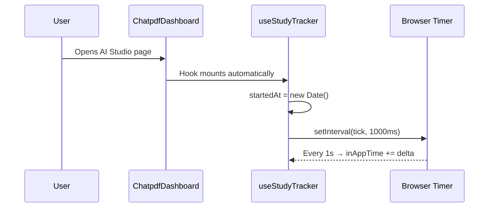
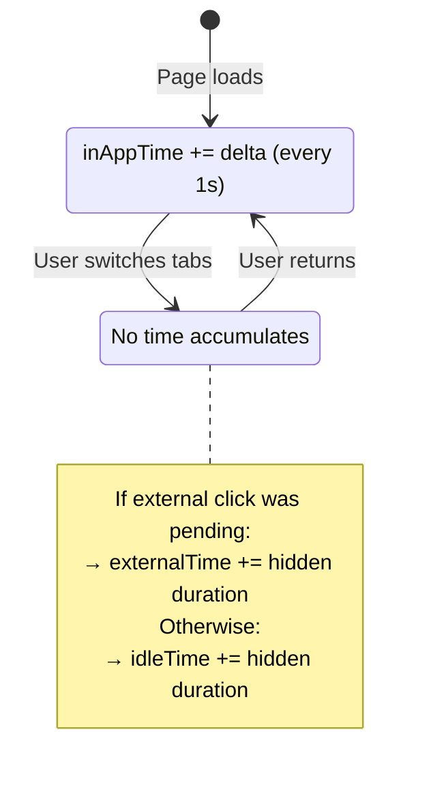
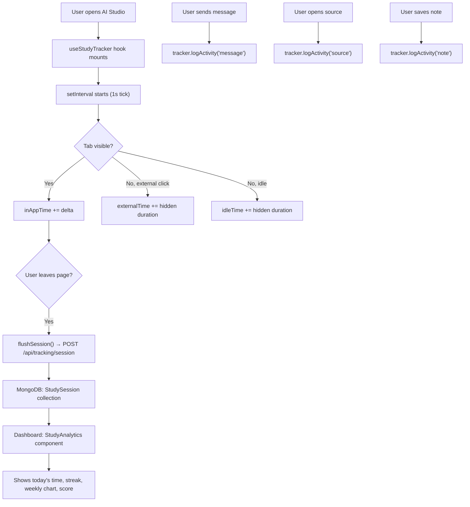

# Study Tracking — How the Timer Starts & How Tracking Works

## Overview

The study tracking system is **fully passive** (zero manual input). It automatically starts timing the moment a user enters the AI Studio page and logs all their study activities in the background.

---

## 🟢 How the Timer Starts



**The timer starts immediately when `ChatpdfDashboard` mounts.** Here's the exact flow:

1. **User navigates to AI Studio** → `ChatpdfDashboard.jsx` renders
2. **Hook initializes** at [line 18](file:///c:/Users/ASUS/OneDrive/Desktop/repo/learnspher/frontend/src/Chatpdf/ChatpdfDashboard.jsx#L18):
   ```js
   const tracker = useStudyTracker({ page: 'ai_studio', notebookId: selectedNotebook?._id });
   ```
3. **Inside the hook**, at [line 21](file:///c:/Users/ASUS/OneDrive/Desktop/repo/learnspher/frontend/src/hooks/useStudyTracker.js#L21), the session start timestamp is recorded:
   ```js
   const startedAt = useRef(new Date());
   ```
4. **A `setInterval` starts ticking every 1 second** at [lines 120-134](file:///c:/Users/ASUS/OneDrive/Desktop/repo/learnspher/frontend/src/hooks/useStudyTracker.js#L120-L134):
   ```js
   timerRef.current = setInterval(() => {
     const now = Date.now();
     const delta = (now - lastTick.current) / 1000;
     lastTick.current = now;
     if (isVisible.current) {
       inAppTime.current += delta;  // Only accumulates when tab is visible
     }
   }, 1000);
   ```

> [!IMPORTANT]
> The timer is **automatic** — no button click needed. It starts the instant the component mounts and only counts time when the browser tab is **visible/focused**.

---

## 📊 What Gets Tracked

The system tracks **3 types of time** and **5 types of activities**:

### Time Categories

| Category | How it's measured | Code location |
|---|---|---|
| **In-App Time** | Timer ticks every 1s while tab is visible | [useStudyTracker.js:126-128](file:///c:/Users/ASUS/OneDrive/Desktop/repo/learnspher/frontend/src/hooks/useStudyTracker.js#L126-L128) |
| **External Time** | Measured when user clicks a YouTube/website link then returns | [useStudyTracker.js:153-166](file:///c:/Users/ASUS/OneDrive/Desktop/repo/learnspher/frontend/src/hooks/useStudyTracker.js#L153-L166) |
| **Idle Time** | Time the tab was hidden without an external click | [useStudyTracker.js:174-176](file:///c:/Users/ASUS/OneDrive/Desktop/repo/learnspher/frontend/src/hooks/useStudyTracker.js#L174-L176) |

### Activity Signals

| Activity | Trigger | Logged from |
|---|---|---|
| **Messages asked** | User sends a chat message | [ChatSection.jsx:15](file:///c:/Users/ASUS/OneDrive/Desktop/repo/learnspher/frontend/src/Chatpdf/ChatSection.jsx#L15) |
| **Sources opened** | User opens a source viewer | [SourceViewer.jsx:15](file:///c:/Users/ASUS/OneDrive/Desktop/repo/learnspher/frontend/src/Chatpdf/SourceViewer.jsx#L15) |
| **Notes written** | User saves a note | [RightPanel.jsx:83](file:///c:/Users/ASUS/OneDrive/Desktop/repo/learnspher/frontend/src/Chatpdf/RightPanel.jsx#L83) |
| **Summaries generated** | User generates a summary | [RightPanel.jsx:179](file:///c:/Users/ASUS/OneDrive/Desktop/repo/learnspher/frontend/src/Chatpdf/RightPanel.jsx#L179) |
| **Study guides viewed** | User views a study guide | [RightPanel.jsx:131](file:///c:/Users/ASUS/OneDrive/Desktop/repo/learnspher/frontend/src/Chatpdf/RightPanel.jsx#L131) |

Components call `tracker.logActivity('message')` or `tracker.logExternalClick('youtube', url)` to log events.

---

## ⏸️ How Tab Visibility Works



The hook listens to the [`visibilitychange`](file:///c:/Users/ASUS/OneDrive/Desktop/repo/learnspher/frontend/src/hooks/useStudyTracker.js#L137-L186) event:

- **Tab becomes hidden** → stops counting in-app time, records timestamp
- **Tab becomes visible again** → checks if an external click was pending:
  - ✅ External click pending → adds hidden duration to `externalTime`
  - ❌ No external click → adds hidden duration to `idleTime`

---

## 💾 How Sessions Are Saved (Flush)

Sessions are flushed to the backend at [useStudyTracker.js:74-117](file:///c:/Users/ASUS/OneDrive/Desktop/repo/learnspher/frontend/src/hooks/useStudyTracker.js#L74-L117) in **two scenarios**:

1. **Component unmounts** (user navigates away from AI Studio)
2. **Page closes** (`beforeunload` event)

The flush sends the entire session payload to `POST /api/tracking/session`:

```json
{
  "userId": "firebase-uid",
  "notebookId": "...",
  "startedAt": "2026-04-02T07:00:00Z",
  "endedAt": "2026-04-02T07:45:00Z",
  "inAppTime": 2400,
  "externalTime": 300,
  "idleTime": 120,
  "totalTime": 2700,
  "activities": {
    "messagesAsked": 12,
    "sourcesOpened": 3,
    "notesWritten": 2,
    "summariesGenerated": 1,
    "studyGuidesViewed": 0,
    "externalClicks": [...]
  },
  "productivityScore": 72,
  "page": "ai_studio"
}
```

> [!NOTE]
> Uses `navigator.sendBeacon()` for reliability (works even when the page is closing), with a `fetch` fallback. Sessions shorter than **30 seconds** are discarded.

---

## 🏆 Productivity Score Calculation

The score (0–100) is computed client-side at [useStudyTracker.js:48-71](file:///c:/Users/ASUS/OneDrive/Desktop/repo/learnspher/frontend/src/hooks/useStudyTracker.js#L48-L71):

| Factor | Scoring |
|---|---|
| **Time base** | ≥1h = 45pts, ≥30m = 35pts, ≥15m = 20pts, ≥5m = 10pts |
| **Messages** | 3pts each, max 15 |
| **Sources** | 2pts each, max 10 |
| **Notes** | 5pts each, max 15 |
| **Summaries + Guides** | 5pts each, max 10 |
| **External clicks** | 2pts each, max 6 |
| **Idle penalty** | −10pts if idle > 50% of total session |

---

## 📈 Dashboard Display

The [StudyAnalytics](file:///c:/Users/ASUS/OneDrive/Desktop/repo/learnspher/frontend/src/components/Dashboard/StudyAnalytics.jsx) component on the Dashboard page fetches and displays:

| API Endpoint | What it shows |
|---|---|
| `GET /api/tracking/today/:userId` | Today's total time, session count, activity counts, avg score |
| `GET /api/tracking/stats/:userId` | Weekly chart (last 7 days grouped by day) |
| `GET /api/tracking/streak/:userId` | Consecutive study days (sessions ≥5min count) |

Data auto-refreshes every **2 minutes**.

---

## 🗄️ Backend Storage

All sessions are persisted in MongoDB via the [StudySession model](file:///c:/Users/ASUS/OneDrive/Desktop/repo/learnspher/backend/src/models/StudySession.js) with indexes on `(userId, startedAt)` for fast queries.

## Complete Architecture


