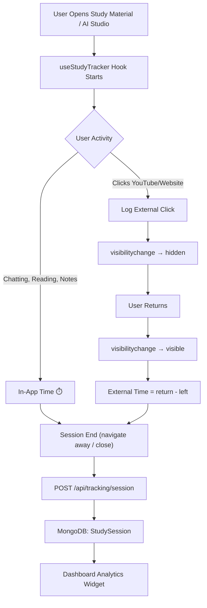

# 📊 Study Tracking Module — Full Implementation Plan

> **Goal**: Track study time passively (no manual input), measure productivity, and display insights on the dashboard.

---

## Architecture Overview



---

## Phase 1: Backend — Data Model & API

### 1.1 MongoDB Schema

**File**: `backend/src/models/StudySession.js`

```javascript
// Schema for tracking individual study sessions
const StudySessionSchema = new Schema({
  userId:       { type: String, required: true, index: true },
  notebookId:   { type: Schema.Types.ObjectId, ref: 'Notebook' },
  materialId:   { type: String },              // study material ID (if on dashboard)
  
  // Timing
  startedAt:    { type: Date, required: true },
  endedAt:      { type: Date },
  
  // Duration breakdown (in seconds)
  inAppTime:        { type: Number, default: 0 },  // active time within the app
  externalTime:     { type: Number, default: 0 },  // estimated time on YouTube/websites
  idleTime:         { type: Number, default: 0 },  // tab open but no interaction
  totalTime:        { type: Number, default: 0 },  // inApp + external
  
  // Activity signals
  activities: {
    messagesAsked:     { type: Number, default: 0 },
    sourcesOpened:     { type: Number, default: 0 },
    notesWritten:      { type: Number, default: 0 },
    summariesGenerated:{ type: Number, default: 0 },
    studyGuidesViewed: { type: Number, default: 0 },
    externalClicks:    [{ 
      type:     String,   // 'youtube' | 'website'
      url:      String,
      leftAt:   Date,
      returnedAt: Date,
      duration: Number    // seconds
    }]
  },
  
  // Productivity score (0-100)
  productivityScore: { type: Number, default: 0 },
  
  // Page context
  page: { type: String, enum: ['ai_studio', 'study_material', 'dashboard'] }
}, { timestamps: true });
```

### 1.2 API Routes

**File**: `backend/src/routes/tracking.js`

| Method | Endpoint | Purpose |
|--------|----------|---------|
| `POST` | `/api/tracking/session` | Save a completed study session |
| `GET` | `/api/tracking/stats/:userId` | Get weekly/monthly stats |
| `GET` | `/api/tracking/today/:userId` | Get today's study time |
| `GET` | `/api/tracking/streak/:userId` | Get current study streak |

---

## Phase 2: Frontend — Study Tracker Hook

### 2.1 Core Hook: `useStudyTracker`

**File**: `frontend/src/hooks/useStudyTracker.js`

This hook auto-runs on every tracked page. Zero manual input needed.

```
┌─────────────────────────────────────────────┐
│              useStudyTracker()              │
├─────────────────────────────────────────────┤
│                                             │
│  On Mount:                                  │
│    → Record startedAt                       │
│    → Start inAppTimer (setInterval 1s)      │
│    → Attach visibilitychange listener       │
│    → Attach beforeunload listener           │
│                                             │
│  visibilitychange → "hidden":               │
│    → Pause inAppTimer                       │
│    → If externalClickPending:               │
│        Record leftAt for that click         │
│    → Else: start idleTimer                  │
│                                             │
│  visibilitychange → "visible":              │
│    → Resume inAppTimer                      │
│    → If externalClickPending:               │
│        Record returnedAt                    │
│        Calculate external duration           │
│        Add to externalTime total            │
│        Clear externalClickPending           │
│    → Else: add to idleTime                  │
│                                             │
│  On Unmount / beforeunload:                 │
│    → Stop all timers                        │
│    → Calculate productivityScore            │
│    → POST session to backend                │
│                                             │
└─────────────────────────────────────────────┘
```

### 2.2 External Click Tracking Flow

```
User clicks YouTube link in SourceViewer
         │
         ▼
logExternalClick('youtube', url)
  → Sets externalClickPending = true
  → Stores { type, url, leftAt: null }
         │
         ▼
Browser opens new tab → LearnSphere tab goes hidden
  → visibilitychange fires
  → leftAt = Date.now()
         │
         ▼
User finishes watching → switches back to LearnSphere
  → visibilitychange fires (visible)
  → returnedAt = Date.now()
  → duration = returnedAt - leftAt
  → Pushes to activities.externalClicks[]
  → externalTime += duration
  → externalClickPending = false
```

### 2.3 Integration Points (where to call the hook)

| Component | What to track |
|-----------|---------------|
| `ChatpdfDashboard.jsx` | Wrap with `useStudyTracker({ page: 'ai_studio', notebookId })` |
| `StudyMaterialDetail.jsx` | Wrap with `useStudyTracker({ page: 'study_material', materialId })` |
| `ChatSection.jsx` | On each `onSendMessage` → `tracker.logActivity('message')` |
| `RightPanel.jsx` | On summary/guide generate → `tracker.logActivity('summary')` |
| `SourceViewer.jsx` | On source open → `tracker.logActivity('sourceOpen')` |
| `SourceViewer.jsx` | On YouTube/website external link click → `tracker.logExternalClick(type, url)` |
| `RightPanel.jsx` | On note save → `tracker.logActivity('note')` |

---

## Phase 3: Productivity Score Calculation

```
Score = weighted sum (0-100):

  Base Score (time-based):
    ├── In-App Active Time > 15 min    → 20 pts
    ├── In-App Active Time > 30 min    → 35 pts
    └── In-App Active Time > 60 min    → 45 pts

  Engagement Bonus:
    ├── Each question asked            → +3 pts (max 15)
    ├── Each source opened             → +2 pts (max 10)
    ├── Each note written              → +5 pts (max 15)
    ├── Summary/guide generated        → +5 pts (max 10)
    └── External resource viewed       → +2 pts (max 6)

  Penalties:
    └── Idle time > 50% of session     → −10 pts

  Final = clamp(0, 100, Base + Bonus − Penalties)
```

---

## Phase 4: Dashboard Analytics Widget

### 4.1 Widget Components

**File**: `frontend/src/components/Dashboard/StudyAnalytics.jsx`

```
┌──────────────────────────────────────────────────┐
│  📊 Your Study Insights                          │
├──────────────────────────────────────────────────┤
│                                                  │
│  ┌────────────┐  ┌────────────┐  ┌────────────┐ │
│  │  Today     │  │  Streak    │  │  Score     │ │
│  │  2h 14m    │  │  🔥 5 days │  │  78/100    │ │
│  └────────────┘  └────────────┘  └────────────┘ │
│                                                  │
│  Weekly Activity (bar chart)                     │
│  ┌──────────────────────────────────────────┐   │
│  │  ██                                      │   │
│  │  ██  ██      ██                          │   │
│  │  ██  ██  ██  ██  ██      ██              │   │
│  │  Mon Tue Wed Thu Fri Sat Sun             │   │
│  └──────────────────────────────────────────┘   │
│  ■ In-App  ■ External Resources  ■ Idle         │
│                                                  │
│  Time Breakdown                                  │
│  ├── AI Studio:         1h 20m                  │
│  ├── Study Materials:   35m                     │
│  └── External (est.):   19m                     │
│                                                  │
└──────────────────────────────────────────────────┘
```

### 4.2 Where It Appears

- **Dashboard page** → Below the Welcome Banner, above Study Materials
- **Sidebar** → Small "Today: 2h 14m" indicator near credits

---

## File List (all files to create/modify)

### New Files (7)
| File | Purpose |
|------|---------|
| `backend/src/models/StudySession.js` | MongoDB schema |
| `backend/src/routes/tracking.js` | API endpoints |
| `frontend/src/hooks/useStudyTracker.js` | Core tracking hook |
| `frontend/src/components/Dashboard/StudyAnalytics.jsx` | Dashboard widget |
| `frontend/src/components/Dashboard/StudyAnalytics.css` | Widget styles |
| `frontend/src/components/Dashboard/WeeklyChart.jsx` | Bar chart component |
| `frontend/src/components/Dashboard/WeeklyChart.css` | Chart styles |

### Modified Files (7)
| File | Change |
|------|--------|
| `backend/src/app.js` | Add `trackingRoutes` to express |
| `frontend/src/Chatpdf/ChatpdfDashboard.jsx` | Initialize `useStudyTracker` |
| `frontend/src/Chatpdf/ChatSection.jsx` | Log `message` activity on send |
| `frontend/src/Chatpdf/RightPanel.jsx` | Log `summary`, `guide`, `note` activities |
| `frontend/src/Chatpdf/SourceViewer.jsx` | Log `sourceOpen` + `externalClick` on YouTube/website links |
| `frontend/src/pages/Dashboard.jsx` | Add `<StudyAnalytics />` widget |
| `frontend/src/components/Dashboard/Sidebar.jsx` | Show "Today: Xh Ym" in sidebar |

---

## Implementation Order

> [!IMPORTANT]
> Estimated total: **5-6 hours** across all phases

### Step 1 — Backend Model + Routes (~45 min)
- [ ] Create `StudySession.js` model
- [ ] Create `tracking.js` routes (POST session, GET stats)
- [ ] Register routes in `app.js`
- [ ] Test with Postman/curl

### Step 2 — useStudyTracker Hook (~90 min)
- [ ] Build the core hook with timers
- [ ] Implement `visibilitychange` listener
- [ ] Implement `logExternalClick()` for YouTube/website return tracking
- [ ] Implement `logActivity()` for chat, notes, summaries
- [ ] Implement `beforeunload` to flush session
- [ ] Add productivity score calculation

### Step 3 — Integration (~60 min)
- [ ] Hook into `ChatpdfDashboard.jsx`
- [ ] Add activity logging calls in `ChatSection`, `RightPanel`, `SourceViewer`
- [ ] Tag external YouTube/website clicks in `SourceViewer.jsx`

### Step 4 — Dashboard Widget (~90 min)
- [ ] Build `StudyAnalytics.jsx` with stat cards
- [ ] Build `WeeklyChart.jsx` (pure CSS bar chart, no extra libraries)
- [ ] Style with `StudyAnalytics.css` (emerald theme)
- [ ] Add to Dashboard page
- [ ] Add today's time indicator in Sidebar

### Step 5 — Polish (~30 min)
- [ ] Test full flow: open notebook → chat → click YouTube → return → check dashboard
- [ ] Handle edge cases (tab close, network failure, session < 30s ignored)
- [ ] Add loading states and empty states
